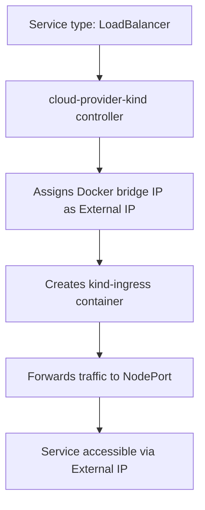

# 🌥️ Solution: Cloud Provider Kind and Port Mapping Requirements

## 📋 Table of Contents
1. [The Question](#the-question)
2. [Understanding Cloud Provider Kind](#understanding-cloud-provider-kind)
3. [Why Kind "Doesn't Detect" LoadBalancer](#why-kind-doesnt-detect-loadbalancer)
4. [Proper Cloud Provider Kind Setup](#proper-cloud-provider-kind-setup)
5. [Port Mapping Requirements Comparison](#port-mapping-requirements-comparison)
6. [Complete Working Examples](#complete-working-examples)
7. [When to Use Which Approach](#when-to-use-which-approach)
8. [Troubleshooting](#troubleshooting)
9. [Conclusion](#conclusion)

---

## ❓ The Question

**"We're using cloud provider kind for external load balancer, so why does Kind detect no LB present? And do we still need to map container ports during cluster creation?"**

This is a critical question that highlights the difference between:
- **Default Kind behavior** (no cloud provider)
- **Cloud Provider Kind** (simulated cloud provider)
- **Manual port mapping** (extraPortMappings)

---

## 🌥️ Understanding Cloud Provider Kind

### What is Cloud Provider Kind?
`cloud-provider-kind` is a **simulated cloud provider** that runs inside Kind clusters to mock real cloud provider behavior (like AWS ELB, GCP Load Balancer, etc.).

### 🔧 How It Works:


### 🧩 Key Components:
1. **Controller Manager** - Watches for LoadBalancer services
2. **Kind Ingress Container** - Handles traffic forwarding
3. **Docker Bridge Network** - Provides external IPs (172.18.x.x)

---

## 🔍 Why Kind "Doesn't Detect" LoadBalancer

### 🔹 Default Kind Behavior (Without Cloud Provider):
```bash
# Create a LoadBalancer service
kubectl patch svc prometheus -p '{"spec": {"type": "LoadBalancer"}}'

# Check the result
kubectl get svc prometheus
```

**Output:**
```
NAME         TYPE           CLUSTER-IP     EXTERNAL-IP   PORT(S)
prometheus   LoadBalancer   10.96.100.144  <pending>     9090:31195/TCP
```

**Why `<pending>`?**
- Kind has **no built-in cloud provider**
- Kubernetes waits for a cloud controller to assign external IP
- Without cloud-provider-kind, this never happens
- Service falls back to NodePort behavior

### 🔹 With Cloud Provider Kind (Properly Configured):
```bash
# Same command, but with cloud-provider-kind running
kubectl get svc prometheus
```

**Output:**
```
NAME         TYPE           CLUSTER-IP     EXTERNAL-IP   PORT(S)
prometheus   LoadBalancer   10.96.100.144  172.18.0.5    9090:31195/TCP
```

**Why it works:**
- `cloud-provider-kind` controller assigns Docker bridge IP
- Traffic forwarding is automatically configured
- Service becomes externally accessible

---

## ⚙️ Proper Cloud Provider Kind Setup

### 📋 Step 1: Install Cloud Provider Kind
```bash
# Install the binary
go install sigs.k8s.io/cloud-provider-kind@latest
```

### 📋 Step 2: Configure Kind Cluster
```yaml
# kind-config-with-cloud-provider.yaml
kind: Cluster
apiVersion: kind.x-k8s.io/v1alpha4
name: kind-with-cloud-provider
nodes:
  - role: control-plane
    kubeadmConfigPatches:
      - |
        kind: ClusterConfiguration
        controllerManager:
          extraArgs:
            cloud-provider: external
        apiServer:
          extraArgs:
            cloud-provider: external
      - |
        kind: KubeletConfiguration
        cloudProvider: external
    extraMounts:
      - hostPath: /var/lib/cloud-provider-kind
        containerPath: /var/lib/cloud-provider-kind
```

### 📋 Step 3: Create Cluster
```bash
kind create cluster --config kind-config-with-cloud-provider.yaml
```

### 📋 Step 4: Deploy Cloud Provider Kind Controller
```bash
# Deploy the controller into the cluster
kubectl apply -f https://raw.githubusercontent.com/kubernetes-sigs/cloud-provider-kind/main/deploy/cloud-provider-kind.yaml

# Wait for it to be ready
kubectl wait --for=condition=Ready pod -l app=cloud-provider-kind -n kube-system --timeout=300s
```

### 📋 Step 5: Test LoadBalancer Service
```bash
# Patch Prometheus to LoadBalancer
kubectl patch svc prometheus -n istio-system -p '{"spec": {"type": "LoadBalancer"}}'

# Check if external IP is assigned
kubectl get svc prometheus -n istio-system
```

**Expected Output:**
```
NAME         TYPE           CLUSTER-IP     EXTERNAL-IP   PORT(S)
prometheus   LoadBalancer   10.96.100.144  172.18.0.5    9090:31195/TCP
```

**Access:**
```bash
# Now you can access directly via external IP
curl http://172.18.0.5:9090
```

---

## ⚖️ Port Mapping Requirements Comparison

### 🔍 Question: Do we still need extraPortMappings with cloud-provider-kind?

**Answer:** It depends on your use case!

| Scenario | Needs extraPortMappings? | Access Method | Example URL |
|----------|-------------------------|---------------|-------------|
| **Cloud Provider Kind + LoadBalancer** | ❌ No | Docker bridge IP | `http://172.18.0.5:9090` |
| **Istio Gateway (any setup)** | ✅ Yes | localhost with port mapping | `http://localhost:8080/prometheus` |
| **Default Kind (no cloud provider)** | ✅ Yes | localhost with port mapping | `http://localhost:8080/prometheus` |

### 📊 Detailed Comparison:

#### ✅ Scenario A: Using Cloud Provider Kind
```yaml
# No extraPortMappings needed in Kind config
kind: Cluster
apiVersion: kind.x-k8s.io/v1alpha4
name: kind-with-cloud-provider
# ... cloud provider config ...
```

```bash
# Services get real external IPs
kubectl get svc -n istio-system
```
```
NAME                   TYPE           EXTERNAL-IP   PORT(S)
prometheus             LoadBalancer   172.18.0.5    9090:31195/TCP
grafana                LoadBalancer   172.18.0.6    3000:32001/TCP
istio-ingressgateway   LoadBalancer   172.18.0.4    80:30374/TCP,443:31443/TCP
```

**Access:**
- Prometheus: `http://172.18.0.5:9090` ✅
- Grafana: `http://172.18.0.6:3000` ✅
- Gateway: `http://172.18.0.4/prometheus` ✅

#### ✅ Scenario B: Using Istio Gateway with extraPortMappings
```yaml
# Need extraPortMappings for clean localhost access
kind: Cluster
apiVersion: kind.x-k8s.io/v1alpha4
name: istio-lab
nodes:
  - role: control-plane
    extraPortMappings:
      - containerPort: 80      # Istio Gateway
        hostPort: 8080
        protocol: TCP
```

**Access:**
- All services: `http://localhost:8080/prometheus`, `http://localhost:8080/grafana` ✅

#### ❌ Scenario C: Default Kind (worst of both worlds)
```yaml
# Basic Kind config, no cloud provider, no port mapping
kind: Cluster
apiVersion: kind.x-k8s.io/v1alpha4
name: basic-kind
```

**Result:**
- Services show `EXTERNAL-IP: <pending>` ❌
- Can't access via localhost ❌
- Must use NodePort with Docker IP ❌

---

## 🧪 Complete Working Examples

### Example 1: Cloud Provider Kind Setup
```yaml
# cloud-provider-kind-config.yaml
kind: Cluster
apiVersion: kind.x-k8s.io/v1alpha4
name: kind-cloud-provider
nodes:
  - role: control-plane
    kubeadmConfigPatches:
      - |
        kind: ClusterConfiguration
        controllerManager:
          extraArgs:
            cloud-provider: external
        apiServer:
          extraArgs:
            cloud-provider: external
      - |
        kind: KubeletConfiguration
        cloudProvider: external
    extraMounts:
      - hostPath: /var/lib/cloud-provider-kind
        containerPath: /var/lib/cloud-provider-kind
```

```bash
# Create cluster
kind create cluster --config cloud-provider-kind-config.yaml

# Deploy cloud provider
kubectl apply -f https://raw.githubusercontent.com/kubernetes-sigs/cloud-provider-kind/main/deploy/cloud-provider-kind.yaml

# Install Istio
istioctl install --set values.defaultRevision=default -y

# Deploy observability tools
kubectl apply -f https://raw.githubusercontent.com/istio/istio/release-1.20/samples/addons/prometheus.yaml
kubectl apply -f https://raw.githubusercontent.com/istio/istio/release-1.20/samples/addons/grafana.yaml

# Patch services to LoadBalancer (they'll get external IPs automatically)
kubectl patch svc prometheus -n istio-system -p '{"spec": {"type": "LoadBalancer"}}'
kubectl patch svc grafana -n istio-system -p '{"spec": {"type": "LoadBalancer"}}'

# Check external IPs
kubectl get svc -n istio-system
```

### Example 2: Istio Gateway with Port Mapping
```yaml
# istio-gateway-config.yaml
kind: Cluster
apiVersion: kind.x-k8s.io/v1alpha4
name: istio-gateway-lab
nodes:
  - role: control-plane
    extraPortMappings:
      - containerPort: 80
        hostPort: 8080
        protocol: TCP
      - containerPort: 443
        hostPort: 8443
        protocol: TCP
```

```yaml
# gateway.yaml
apiVersion: networking.istio.io/v1beta1
kind: Gateway
metadata:
  name: observability-gateway
  namespace: istio-system
spec:
  selector:
    istio: ingressgateway
  servers:
    - port:
        number: 80
        name: http
        protocol: HTTP
      hosts:
        - "*"
---
apiVersion: networking.istio.io/v1beta1
kind: VirtualService
metadata:
  name: observability-vs
  namespace: istio-system
spec:
  gateways:
    - observability-gateway
  hosts:
    - "*"
  http:
    - match:
        - uri:
            prefix: /prometheus
      rewrite:
        uri: /
      route:
        - destination:
            host: prometheus.istio-system.svc.cluster.local
            port:
              number: 9090
    - match:
        - uri:
            prefix: /grafana
      rewrite:
        uri: /
      route:
        - destination:
            host: grafana.istio-system.svc.cluster.local
            port:
              number: 3000
```

---

## 🎯 When to Use Which Approach

### ✅ Use Cloud Provider Kind When:
- You want **individual external IPs** for each service
- You need to **test LoadBalancer behavior** similar to cloud environments
- You have **simple service exposure** requirements
- You want to **avoid complex routing** configuration

**Pros:**
- ✅ No manual port mapping needed
- ✅ Automatic external IP assignment
- ✅ Closer to real cloud behavior
- ✅ Each service gets dedicated IP

**Cons:**
- ❌ More complex initial setup
- ❌ Multiple IPs to remember (172.18.0.5, 172.18.0.6, etc.)
- ❌ Not production-like (real clouds use DNS, not IPs)

### ✅ Use Istio Gateway + extraPortMappings When:
- You want **clean path-based routing** (`/prometheus`, `/grafana`)
- You need **centralized traffic management**
- You want **production-like architecture**
- You prefer **single entry point** (localhost:8080)

**Pros:**
- ✅ Clean URLs with paths
- ✅ Single entry point (localhost:8080)
- ✅ Production-ready architecture
- ✅ Advanced traffic management (retries, timeouts, etc.)

**Cons:**
- ❌ Requires manual port mapping
- ❌ More YAML configuration (Gateway + VirtualService)

---

## 🔧 Troubleshooting

### Problem 1: LoadBalancer Shows `<pending>` with Cloud Provider Kind
```bash
# Check if cloud-provider-kind controller is running
kubectl get pods -n kube-system | grep cloud-provider-kind
```

**Solution:**
```bash
# Deploy the controller if missing
kubectl apply -f https://raw.githubusercontent.com/kubernetes-sigs/cloud-provider-kind/main/deploy/cloud-provider-kind.yaml
```

### Problem 2: Can't Access Service via External IP
```bash
# Check if external IP is actually assigned
kubectl get svc <service-name> -o wide
```

**Solution:**
- Ensure cloud-provider-kind is properly configured
- Check Docker bridge network: `docker network ls`
- Verify you're accessing the correct IP and port

### Problem 3: Istio Gateway Not Working with Port Mapping
```bash
# Check if port mapping is correct
docker ps | grep kind
```

**Solution:**
- Verify `extraPortMappings` in Kind config
- Ensure `containerPort: 80` matches Istio Gateway service port
- Check Gateway and VirtualService configuration

---

## 🎯 Conclusion

### Key Takeaways:

1. **Cloud Provider Kind vs Default Kind:**
   - **Default Kind:** LoadBalancer services show `<pending>`, need manual port mapping
   - **Cloud Provider Kind:** LoadBalancer services get automatic external IPs

2. **Port Mapping Requirements:**
   - **With Cloud Provider Kind:** No extraPortMappings needed for LoadBalancer services
   - **With Istio Gateway:** Always need extraPortMappings for clean localhost access

3. **Best Practices:**
   - **For Development/Testing:** Use cloud-provider-kind for simple service exposure
   - **For Production-like Setup:** Use Istio Gateway + VirtualService + port mapping

### Decision Matrix:

| Need | Cloud Provider Kind | Istio Gateway + Port Mapping |
|------|-------------------|------------------------------|
| Quick service exposure | ✅ Best choice | ❌ Overkill |
| Production-like routing | ❌ Too simple | ✅ Best choice |
| Multiple services | ❌ Multiple IPs | ✅ Single entry point |
| Clean URLs | ❌ IP:Port based | ✅ Path-based routing |

### Final Recommendation:

**For learning Istio and production readiness:** Use Istio Gateway + extraPortMappings
**For quick testing of individual services:** Use cloud-provider-kind

Both approaches are valid, and the choice depends on your specific requirements and learning objectives.

---

## 📚 References

- [Cloud Provider Kind Documentation](https://github.com/kubernetes-sigs/cloud-provider-kind)
- [Kind extraPortMappings Guide](https://kind.sigs.k8s.io/docs/user/configuration/#extra-port-mappings)
- [Istio Gateway Configuration](https://istio.io/latest/docs/reference/config/networking/gateway/)
- [Related: Why Rewrite URI is Needed](./why-rewrite.md)
- [Related: Gateway vs LoadBalancer Deep Dive](./question2.md)