# 🤔 Why Can I Access Prometheus Service Directly But Not Through Istio Gateway?

## 📋 Table of Contents
1. [The Core Question](#the-core-question)
2. [Understanding Kind (Kubernetes in Docker)](#understanding-kind-kubernetes-in-docker)
3. [LoadBalancer vs Gateway: The Key Difference](#loadbalancer-vs-gateway-the-key-difference)
4. [Deep Dive: What Happens When You Patch a Service](#deep-dive-what-happens-when-you-patch-a-service)
5. [Why Gateway Needs extraPortMappings](#why-gateway-needs-extraportmappings)
6. [Traffic Flow Comparison](#traffic-flow-comparison)
7. [Practical Examples](#practical-examples)
8. [Best Practices & Recommendations](#best-practices--recommendations)
9. [Troubleshooting Guide](#troubleshooting-guide)
10. [Conclusion](#conclusion)

---

## 🤔 The Core Question

**Why can I access Prometheus service directly from my browser using `http://172.18.0.5:31195`, but I cannot access it through Istio Gateway without mapping container ports during Kind cluster creation?**

The answer lies in understanding how **container networking**, **Kubernetes service types**, and **Kind's simulation** work together.

---

## 🐳 Understanding Kind (Kubernetes in Docker)

### What is Kind?
- **Kind** = Kubernetes in Docker
- Runs a full Kubernetes cluster inside Docker containers
- **No real cloud provider** (no AWS, GCP, Azure integration)
- Must simulate cloud features like LoadBalancers

### Kind's Network Architecture
```
┌─────────────────────────────────────────────────────────────┐
│                    Host Machine (Windows)                   │
│  ┌─────────────────────────────────────────────────────────┐│
│  │              Docker Engine                              ││
│  │  ┌─────────────────────────────────────────────────────┐││
│  │  │           Kind Container                            │││
│  │  │  ┌─────────────────────────────────────────────────┐│││
│  │  │  │         Kubernetes Cluster                      ││││
│  │  │  │  • Pods                                         ││││
│  │  │  │  • Services                                     ││││
│  │  │  │  • Ingress Controllers                          ││││
│  │  │  └─────────────────────────────────────────────────┘│││
│  │  │           IP: 172.18.0.X                           │││
│  │  └─────────────────────────────────────────────────────┘││
│  └─────────────────────────────────────────────────────────┘│
│                                                             │
└─────────────────────────────────────────────────────────────┘
```

---

## ⚖️ LoadBalancer vs Gateway: The Key Difference

### 🔍 Question 1: What happens when I patch Prometheus to LoadBalancer?

**Command:**
```bash
kubectl patch svc prometheus -n istio-system -p '{"spec": {"type": "LoadBalancer"}}'
```

**Answer:**
```yaml
# Before patching
apiVersion: v1
kind: Service
metadata:
  name: prometheus
spec:
  type: ClusterIP          # Only accessible within cluster
  clusterIP: 10.96.100.144
  ports:
  - port: 9090
    targetPort: 9090

# After patching
apiVersion: v1
kind: Service
metadata:
  name: prometheus
spec:
  type: LoadBalancer       # Requests external access
  clusterIP: 10.96.100.144
  externalIPs: 
  - 172.18.0.5             # Kind simulates this
  ports:
  - port: 9090
    nodePort: 31195        # Kind auto-assigns this
    targetPort: 9090
```

### 🔍 Question 2: Why does LoadBalancer work without extraPortMappings?

**Answer:**
Because Kind **automatically simulates** LoadBalancer as NodePort:

1. **Real Cloud (AWS/GCP):** LoadBalancer → Creates actual external load balancer
2. **Kind Environment:** LoadBalancer → **Falls back to NodePort** + assigns Docker bridge IP

```bash
# What Kind does internally:
LoadBalancer request → No cloud provider detected → Convert to NodePort → Assign Docker IP
```

**Result:**
- Service gets external IP: `172.18.0.5` (Docker bridge network)
- Port `9090` is exposed as NodePort `31195`
- Docker automatically publishes `31195` on the bridge network
- You can access: `http://172.18.0.5:31195` ✅

---

## 🔍 Deep Dive: What Happens When You Patch a Service

### Scenario A: Prometheus with LoadBalancer


### Scenario B: Istio Gateway (without extraPortMappings)

```mermaid
graph TD
    A[Istio Gateway listens on port 80] --> B[Kind container has port 80 internal]
    B --> C[No extraPortMappings defined]
    C --> D[Port 80 NOT exposed to host]
    D --> E[Browser cannot reach localhost:8080]
    E --> F[Gateway inaccessible ❌]
```


---

## 🚪 Why Gateway Needs extraPortMappings

### 🔍 Question 3: Why can't I access Istio Gateway without port mapping?

**Answer:**
Because Istio Gateway is a **ClusterIP service by default**, and unlike the LoadBalancer simulation, it doesn't automatically get exposed outside the container.

### Istio Gateway Service Type:
```bash
kubectl get svc -n istio-system istio-ingressgateway
```

Output:
```
NAME                   TYPE           CLUSTER-IP       EXTERNAL-IP   PORT(S)                      AGE
istio-ingressgateway   LoadBalancer   10.96.194.247    <pending>     15021:31756/TCP,80:30374/TCP
```

**Key Points:**
- `EXTERNAL-IP` shows `<pending>` (no real cloud provider)
- Port `80` is mapped to NodePort `30374`
- **BUT** this NodePort is only accessible **inside the Docker container**
- To reach it from your browser, you need `extraPortMappings`

---

## 🚦 Traffic Flow Comparison

### ✅ Direct Prometheus Access (LoadBalancer)
```
Browser Request: http://172.18.0.5:31195
         ↓
Docker Bridge Network (172.18.x.x)
         ↓
Kind Container Port 31195
         ↓
Kubernetes NodePort Service
         ↓
Prometheus Pod (port 9090)
         ↓
Prometheus UI Served ✅
```

### ❌ Istio Gateway (without extraPortMappings)
```
Browser Request: http://localhost:8080/prometheus
         ↓
Host Machine (localhost:8080)
         ↓
❌ NO MAPPING TO CONTAINER
         ↓
Gateway Unreachable ❌
```

### ✅ Istio Gateway (with extraPortMappings)
```yaml
# kind-config.yaml
extraPortMappings:
  - containerPort: 80    # Istio Gateway internal port
    hostPort: 8080       # Your browser access port
```

```
Browser Request: http://localhost:8080/prometheus
         ↓
Host Machine (localhost:8080)
         ↓
extraPortMappings: 8080 → 80
         ↓
Kind Container Port 80
         ↓
Istio Gateway Service
         ↓
VirtualService: /prometheus → rewrite to /
         ↓
Prometheus Service (prometheus.istio-system.svc.cluster.local:9090)
         ↓
Prometheus Pod
         ↓
Prometheus UI Served ✅
```

---

## 🧪 Practical Examples

### Example 1: Why This Works (Direct Service Access)
```bash
# Patch Prometheus to LoadBalancer
kubectl patch svc prometheus -n istio-system -p '{"spec": {"type": "LoadBalancer"}}'

# Check the service
kubectl get svc prometheus -n istio-system
# Output: prometheus LoadBalancer 10.96.100.144 172.18.0.5 9090:31195/TCP

# Access directly
curl http://172.18.0.5:31195
# ✅ Works because Kind simulated LoadBalancer as NodePort + Docker bridge IP
```

### Example 2: Why This Doesn't Work (Gateway without mapping)
```bash
# Try to access Istio Gateway
curl http://localhost:8080/prometheus
# ❌ Fails: Connection refused

# Check Istio Gateway service
kubectl get svc -n istio-system istio-ingressgateway
# Output: istio-ingressgateway LoadBalancer 10.96.194.247 <pending> 80:30374/TCP

# The issue: Port 80 (containerPort) is not mapped to host port 8080
```

### Example 3: Fix with extraPortMappings
```yaml
# kind-config.yaml
kind: Cluster
apiVersion: kind.x-k8s.io/v1alpha4
name: istio-lab
nodes:
  - role: control-plane
    extraPortMappings:
      - containerPort: 80      # Map Istio Gateway port
        hostPort: 8080         # To localhost:8080
        protocol: TCP
```

```bash
# Now this works:
curl http://localhost:8080/prometheus
# ✅ Success: Traffic routed through Istio Gateway → VirtualService → Prometheus
```

---

## ⭐ Best Practices & Recommendations

### ✅ Do This:
1. **Use Istio Gateway + VirtualService** for all external access
2. **Map only Gateway ports** (80, 443) in Kind config
3. **Keep services as ClusterIP** (don't patch to LoadBalancer)
4. **Use rewrite.uri: /** for tools like Prometheus, Grafana

### ❌ Avoid This:
1. **Don't patch every service to LoadBalancer**
2. **Don't map individual service ports** (9090, 3000, etc.)
3. **Don't rely on Docker bridge IPs** (172.18.x.x) for production

### 📋 Recommended Kind Config:
```yaml
# kind-config.yaml
kind: Cluster
apiVersion: kind.x-k8s.io/v1alpha4
name: istio-lab
nodes:
  - role: control-plane
    extraPortMappings:
      - containerPort: 80      # HTTP (Istio Gateway)
        hostPort: 8080
        protocol: TCP
      - containerPort: 443     # HTTPS (optional)
        hostPort: 8443
        protocol: TCP
```

### 📋 Recommended VirtualService:
```yaml
apiVersion: networking.istio.io/v1beta1
kind: VirtualService
metadata:
  name: observability-tools
  namespace: istio-system
spec:
  gateways:
    - istio-monitoring-gateway
  hosts:
    - "*"
  http:
    - match:
        - uri:
            prefix: /prometheus
      rewrite:
        uri: /
      route:
        - destination:
            host: prometheus.istio-system.svc.cluster.local
            port:
              number: 9090
    - match:
        - uri:
            prefix: /grafana
      rewrite:
        uri: /
      route:
        - destination:
            host: grafana.istio-system.svc.cluster.local
            port:
              number: 3000
```

---

## 🔧 Troubleshooting Guide

### Problem 1: "I can access Prometheus directly but not through Gateway"
**Diagnosis:**
```bash
# Check if Gateway service has external IP
kubectl get svc -n istio-system istio-ingressgateway
```

**Solution:**
- If `EXTERNAL-IP` is `<pending>`, you need `extraPortMappings`
- Add container port mapping in Kind config and recreate cluster

### Problem 2: "Gateway returns 404 for /prometheus"
**Diagnosis:**
```bash
# Check VirtualService configuration
kubectl get virtualservice -n istio-system -o yaml
```

**Solution:**
- Ensure `rewrite.uri: /` is present
- Verify destination host and port are correct

### Problem 3: "localhost:8080 connection refused"
**Diagnosis:**
```bash
# Check Kind port mappings
docker ps | grep kind
```

**Solution:**
- Verify `extraPortMappings` in Kind config
- Ensure `containerPort: 80` maps to `hostPort: 8080`

---

## 🎯 Conclusion

### Key Takeaways:

1. **LoadBalancer in Kind ≠ Real LoadBalancer**
   - Kind simulates LoadBalancer as NodePort + Docker bridge IP
   - That's why `http://172.18.0.5:31195` works for Prometheus

2. **Gateway Requires Explicit Port Mapping**
   - Istio Gateway needs `extraPortMappings` to be accessible from host
   - Without mapping, Gateway remains inside the container

3. **Cloud Provider vs Kind**
   - **Real Cloud:** LoadBalancer creates actual external LB with public IP
   - **Kind:** LoadBalancer falls back to NodePort with Docker bridge IP

4. **Best Architecture**
   - Use Istio Gateway as single entry point
   - Route all traffic through VirtualService
   - Map only Gateway ports (80, 443) to host

### The Bottom Line:
```
Direct Service Access    = Kind's LoadBalancer simulation (automatic)
Gateway Access          = Manual port mapping required (extraPortMappings)
```

Both methods work, but **Istio Gateway + VirtualService** provides:
- ✅ Clean URLs (`/prometheus`, `/grafana`)
- ✅ Centralized traffic control
- ✅ Production-ready architecture
- ✅ Better security and observability

---

## 📚 Further Reading

- [Kind Documentation - extraPortMappings](https://kind.sigs.k8s.io/docs/user/configuration/#extra-port-mappings)
- [Istio Gateway Configuration](https://istio.io/latest/docs/reference/config/networking/gateway/)
- [Kubernetes Service Types](https://kubernetes.io/docs/concepts/services-networking/service/#publishing-services-service-types)
- [Why Rewrite URI is Needed](./why-rewrite.md)

---

*This guide provides a comprehensive understanding of networking concepts in Kind + Istio environments. For questions or clarifications, refer to the troubleshooting section above.*
